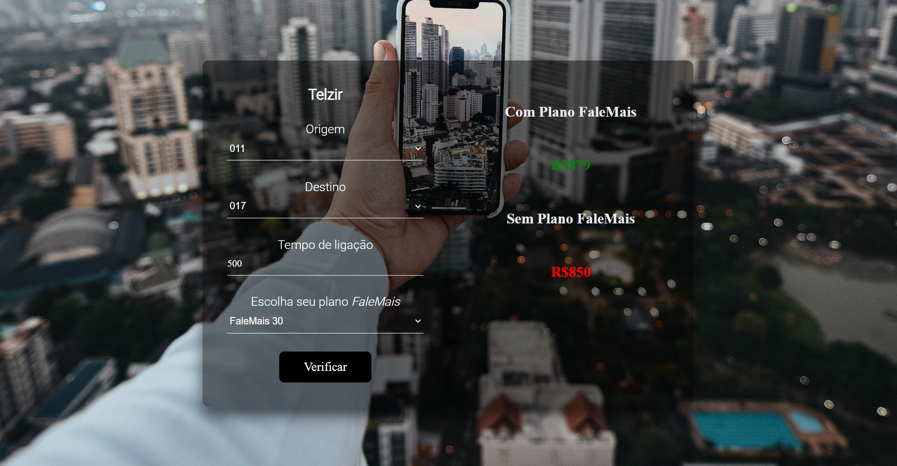

# Telzir frontend
Aplicação desenvolvida utilizando React e integrada com uma api .NodeJS

## Demonstração do Projeto

## Scripts disponiveis
No diretório do projeto, você pode executar:

### `yarn start`

Runs the app in the development mode. 
Open [http://localhost:3000](http://localhost:3000) to view it in the browser.

The page will reload if you make edits. 
You will also see any lint errors in the console.

This project was bootstrapped with [Create React App](https://github.com/facebook/create-react-app).
